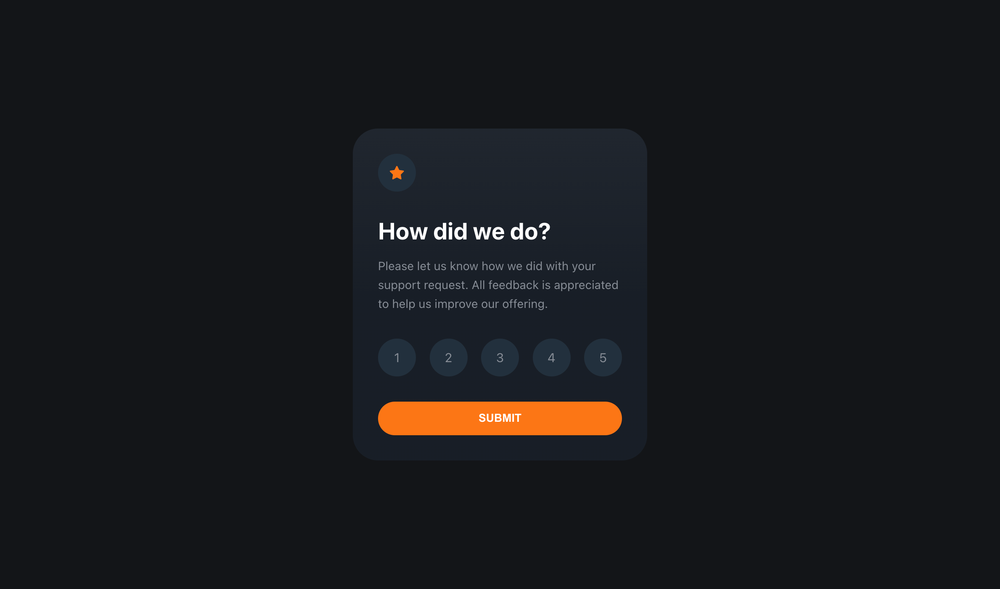

# FM - Interactive rating component



[=> Live Preview on Vercel](https://fm-interactive-rating-component-ebon.vercel.app/)

## Moin! 👋

Thanks for checking out my solution to the front-end coding challenge. Feel free to add any comments!

I used React, TypeScript, and CSS3, including custom properties, to fulfill this challenge.

## The challenge

[=> Interactive rating component challenge on Frontend Mentor](https://www.frontendmentor.io/challenges/interactive-rating-component-koxpeBUmI)

My challenge was to build out an interactive rating component and get it looking as close to the upper design as possible. - I am using the free version of Frontend Mentor, so it is a lot of guessing when it comes to spacings and sizes... :D

The users should be able to:

- View the optimal layout for the app depending on their device's screen size
- See hover states for all interactive elements on the page
- Select and submit a number rating
- See the "Thank you" card state after submitting a rating

## Run project
```
npm start
```